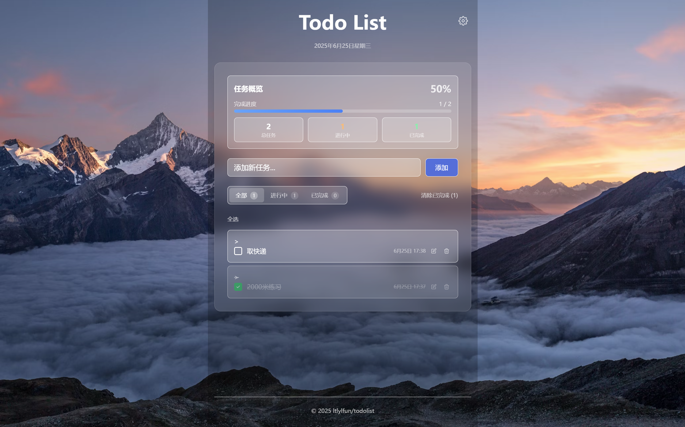
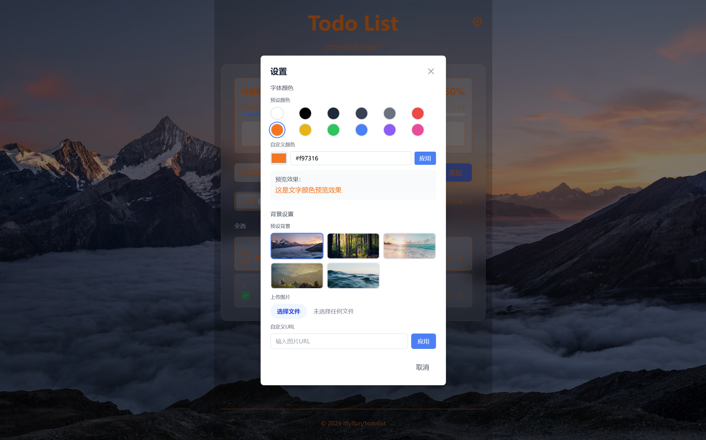

  

# Svelte Todo List

一个简洁高效的待办事项（Todo List）应用，支持添加、编辑、删除、完成任务，按状态筛选，统计任务数量，并可自定义主题设置，适合日常任务管理。

## 🖼️ 截图展示

## 📄 许可证

[MIT License](./LICENSE)

## 🙏 致谢

- [Svelte](https://svelte.dev/) - 优秀的前端框架
- [Tailwind CSS](https://tailwindcss.com/) - 实用的 CSS 框架
- [Vite](https://vitejs.dev/) - 快速的构建工具

---

⭐ 如果这个项目对你有帮助，请给个 Star！
